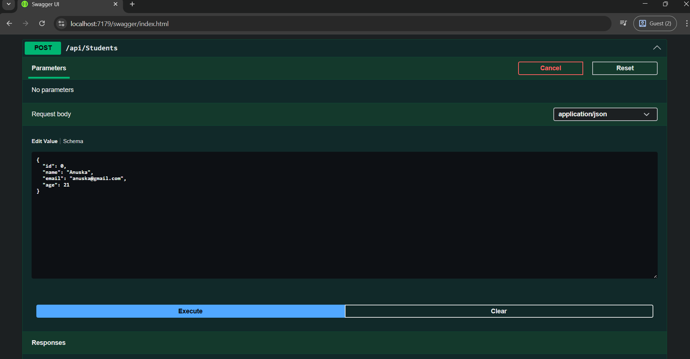
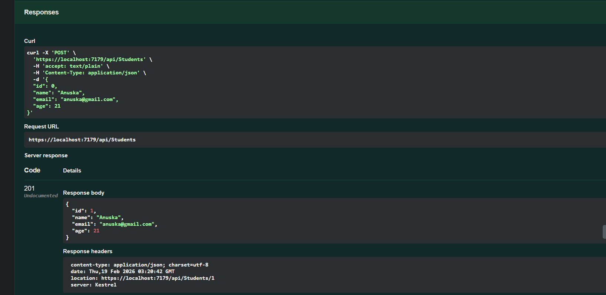
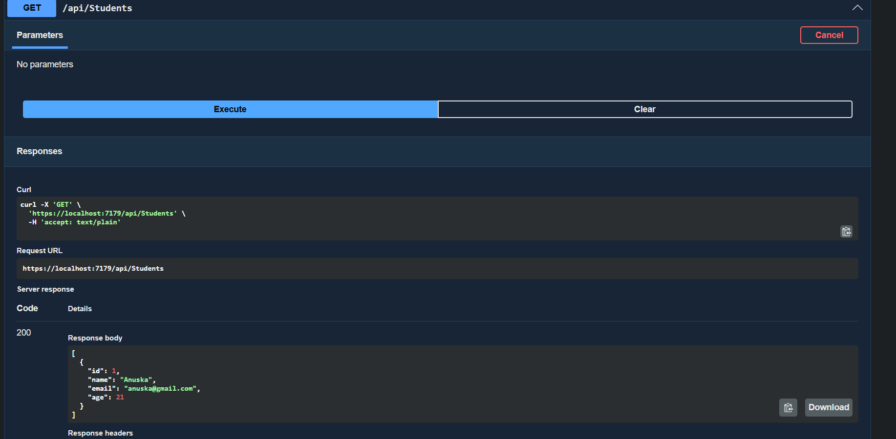
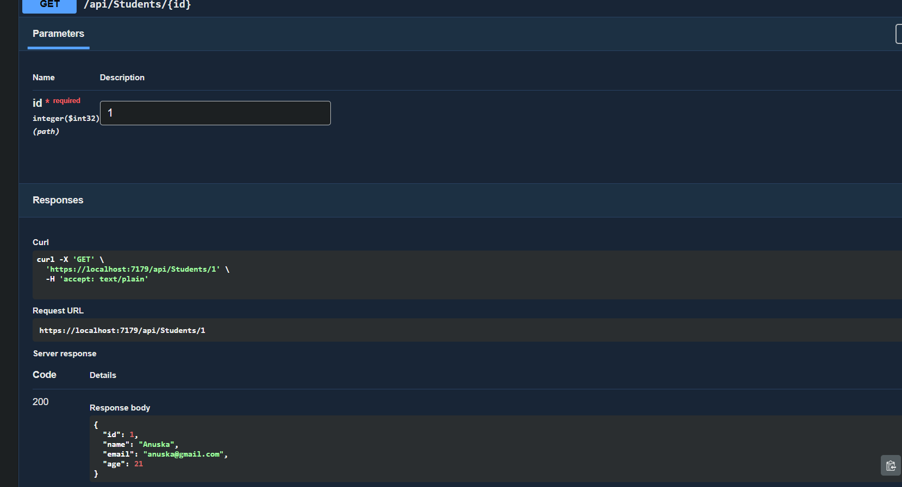
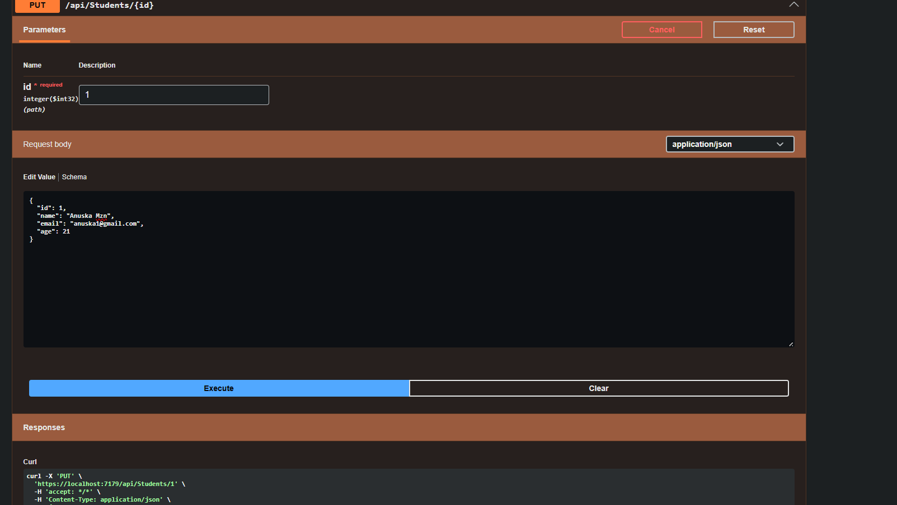
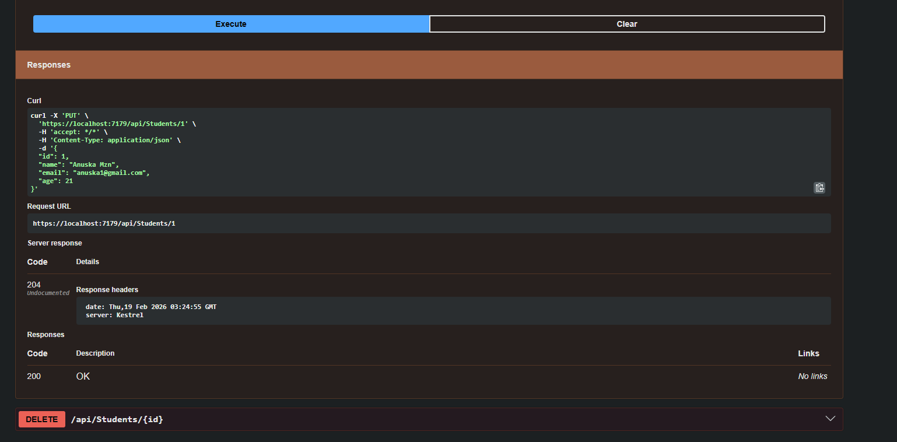
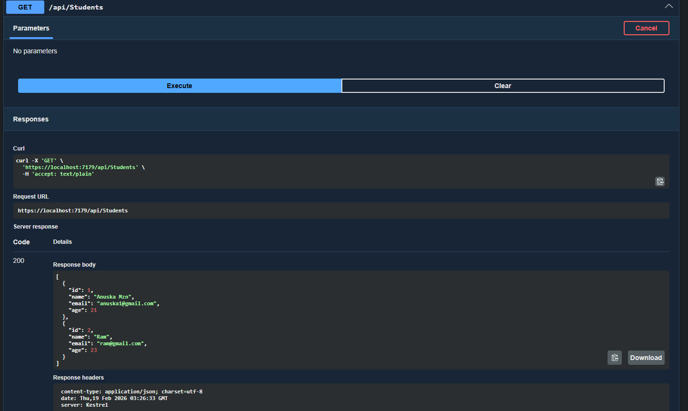
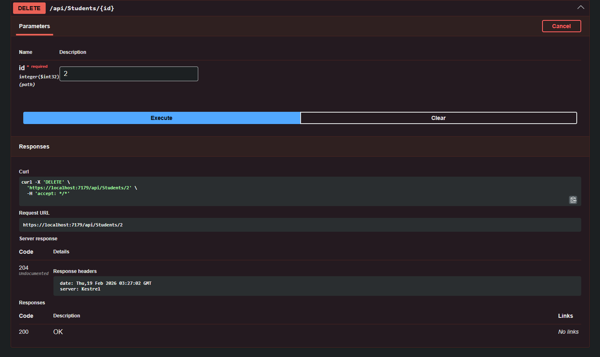
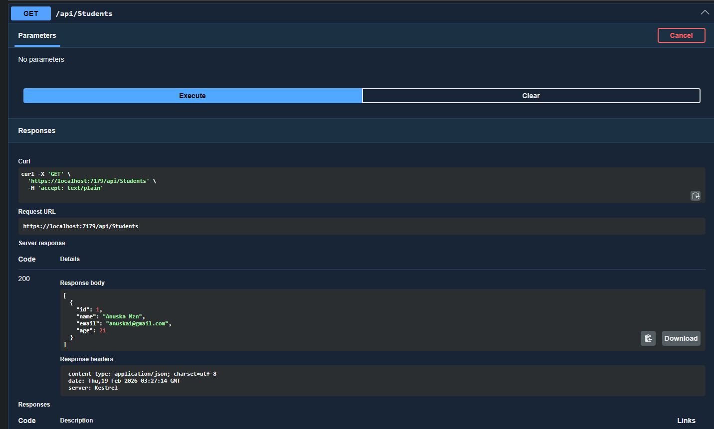

# Student Management System

A simple full-stack **Student Management** application with:

- **Backend**: ASP.NET Core 7 Web API + Entity Framework Core + SQL Server
- **Frontend**: Vanilla HTML + CSS + JavaScript (no frameworks)

Both frontend and backend are hosted from the same .NET project.

## Features

- CRUD operations for students
- RESTful API endpoints
- Clean, responsive frontend with table view
- Real-time data loading and updates using `fetch` API
- Swagger UI for API testing
- Simple but pleasant UI with cards and styled table

## Tech Stack

| Layer       | Technology                          |
|-------------|-------------------------------------|
| Backend     | .NET 7 (ASP.NET Core Web API)       |
| ORM         | Entity Framework Core               |
| Database    | SQL Server                          |
| Frontend    | HTML5, CSS3, Vanilla JavaScript     |
| API Testing | Swagger UI (built-in)               |
| HTTP Client | Fetch API (browser native)          |

## Project Structure
```text
StudentManagement/
├── Controllers/
│   └── StudentsController.cs
├── Models/
│   └── Student.cs
├── Data/
│   └── AppDbContext.cs
├── wwwroot/
│   ├── index.html
│   ├── style.css
│   │── script.js
├── appsettings.json
├── Program.cs
└── ...
```

## API Endpoints

| Method | Endpoint                | Description                  | Request Body (JSON)         |
|--------|-------------------------|------------------------------|------------------------------|
| GET    | `/api/Students`         | Get all students             | —                            |
| GET    | `/api/Students/{id}`    | Get student by ID            | —                            |
| POST   | `/api/Students`         | Create new student           | `{ "name": "", "email": "", "age": 0 }` |
| PUT    | `/api/Students/{id}`    | Update existing student      | same as POST                 |
| DELETE | `/api/Students/{id}`    | Delete student               | —                            |

## How to Run the Project

### Prerequisites

- .NET 7 SDK
- SQL Server (local or remote)

### Steps

1. **Clone the repository**

```bash
git clone https://github.com/anuskamhzn/StudentManagement.git
cd student-management
```

2. **Update connection string (if needed)**

Open appsettings.json or appsettings.Development.json and adjust:
```bash
JSON"ConnectionStrings": {
  "DefaultConnection": "Server=localhost;Database=StudentDb;Trusted_Connection=True;TrustServerCertificate=True;" 
  }
```

3. **Create & migrate database**

```bash
dotnet ef migrations add InitialCreate
dotnet ef database update
```

4. **Run the application**

5. **Open browser at:**

```bash
https://localhost:7179           → Frontend (index.html)
https://localhost:7179/swagger   → API documentation & testing
```
Note: Port 7179 is just an example — your port may be different (check console output).

## Screenshot










